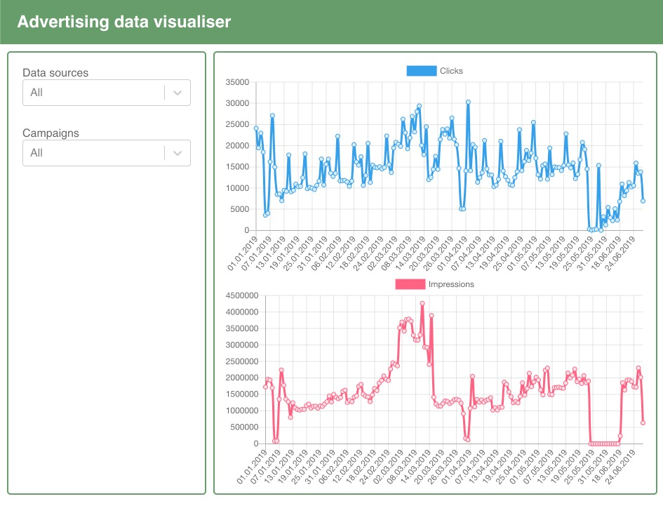

## How to run

### Backend
`./gradlew run`

### Frontend
`./yarn install` or `npm install`

`./yarn test` or `npm run test`

`./yarn dev` or `npm run dev`

go to `http://localhost:8080`

you should see following screen:

## Remarks

Backend is written in **Kotlin** with micronaut framework. It uses h2 in memory database to store advertising cvs file. Csv file is downloaded **5 seconds** after backend is ready to process requests. You can ovbserve downloading and parsing progress in the console. H2 databse is used for retriving data in optimal way. One could do that by hand by it's a lot easier and readable to pass it to the database engine.

I used [JDBI](https://jdbi.org/) as db access layer. There is not security involved as this is beyond of the scope of this task but normally I would use jwt with refresh tokens.

Frontend is built with **Typescript**. I used sass for styling and I resigned from scoped (css modules) intentionaly for code simplicity. To communicate with the backend I used [React Query](https://github.com/tannerlinsley/react-query) (it also can be used as redux replacement in simpler apps) and [Axios](https://github.com/axios/axios). Charts are being rendered by [React-Chartjs](https://github.com/jerairrest/react-chartjs-2) (wrapper around https://www.chartjs.org/). Unforunatelly I wasn't be able to create two data series with separate y axis on one chart due to chartjs's scaling bug. Axes were drawn correctly but the second line was not scaled accordingly and painted outside the graph area.
I also used [React Select](https://react-select.com/home) for multiple select drop down.

I didn't use any linters or formatting tools like prettier but I would if more devs were involved.

Hope you like it :)

